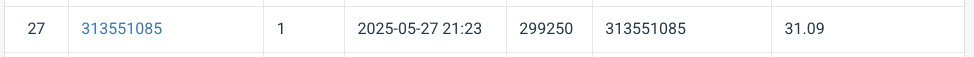

# NYCU Visual Recognition Deep Learning 2025 Homework 4  
*Blind Image Restoration – **Rain & Snow** Removal*

Student ID: 313551085  
Name: 謝振杰  

> This project is **forked & modified** from the original  
> [**PromptIR**](https://github.com/va1shn9v/PromptIR) repository.

---

## 1. Introduction  

The goal of HW4 is to restore clean RGB images from their rain- or snow-degraded
counterparts (blind restoration).  
My solution is based on **PromptIR** (*Prompting for All-in-One Blind Image
Restoration*, CVPR 2024) with the following customisations:

* **Decoder-enabled PromptIR backbone** + channel-reduced prompts.
* **L1 + SSIM hybrid loss** with cosine-annealing LR.
* **Advanced data pipeline**
  * random crop (`128 × 128`), strong geometric + color aug.,
  * optional *CutMix* blending between samples.
* **Test-time augmentation (TTA)** mirroring the 8 augmentation modes used in
  training.
* **Robust tiled inference** (adaptively pads & blends overlaps) and
  autogeneration of the **`pred.npz → zip`** file for CodaBench submission.
* Utilities for resolution inspection, visualisation grids and quick
  notebook-based comparison of two checkpoints.

---

## 2. Repository Structure  

```

├── datasets_hw4.py            # custom Dataset + DataLoaders
├── lightning_module.py        # PromptIR + loss + optimizer (PyTorch-Lightning)
├── net/                       # modified PromptIR backbone
│   └── model.py
├── train_hw4.py               # single/-multi GPU training entry-point
├── infer_hw4.py               # inference + pred.npz + zip packager
├── utils/
│   ├── image_utils.py         # misc. image helpers & augmentations
│   ├── val_utils.py           # PSNR / SSIM / NIQE metrics
│   ├── loss_utils.py          # GANLoss (unused atm)
│   └── ...                    # schedulers, degradation, I/O …
├── dataset_stats.py           # scan min / max H × W of PNGs
├── analysis.ipynb             # visualisation notebook
├── .devcontainer/             # VSCode CUDA dev-container (PyTorch 24.03)
├── requirements.txt # pip dependencies
└── README.md                  

````

---

## 3. Installation  

The easiest way is to open the folder in **VS Code → “Reopen in
Dev-Container”** (image: `nvcr.io/nvidia/pytorch:24.03-py3`).  
Everything inside `requirements.txt` will be installed automatically.

Manual steps:

```bash
# build / enter your own CUDA 11.8 python=3.10 env, then:
pip install -r requirements.txt
````

---

## 4. Dataset Preparation

Expected directory layout

```
data/
├── train/
│   ├── clean/
│   │   ├── rain_clean-<id>.png
│   │   └── snow_clean-<id>.png
│   └── degraded/
│       ├── rain-<id>.png
│       └── snow-<id>.png
└── test/
    └── degraded/
        └── <id>.png
```

*If you already renamed your degraded/clean files 1-to-1, they will still load
correctly (no “\_clean” suffix required).*
Run a quick resolution sanity-check:

```bash
python dataset_stats.py data/train/clean
# Resolution summary  →  min: 256x256   max: 256x256
```

---

## 5. Usage

### 5-1  Training

```bash
python train_hw4.py \
  --data_root data \
  --batch     6 \
  --patch     128 \
  --epochs    120 \
  --gpus      1           # >1 will trigger DDP
  --accum     3           # gradient accumulation (effective batch = 18)
  --precision 32
```

Checkpoints are saved to `ckpts/` every epoch (**no auto-delete**; keep last 5).

### 5-2  Inference & Leaderboard Submission

```bash
python infer_hw4.py \
  --ckpt     ckpts/promptirnewssim-epoch=187-val_PSNR=34.12.ckpt \
  --data_root data/test/degraded \
  --tile     64   --overlap 32 \
  --tta              \           # enable 8-mode TTA
  --zip_name  myrun.zip          # output zip → upload directly
```

* Produces `pred.npz` (dict: `{filename: (3,H,W) uint8}`)
* Wraps it into `myrun.zip` automatically.

### 5-3  Visualising Validation Results
Use `analysis.ipynb` to visualize the model output.

---

## 6. Performance

| Setting                                   | Patch | Batch | PSNR (dB) |
| ----------------------------------------- | :---: | :---: | :-------: |
| **PromptIR + decoder + SSIM** (this work) |  128  |  6×3  |  **30.38** |

> PSNR measured on the hidden validation split (5 %)

 <!-- drop-in if you have one -->

---

## 7. Homework Report
Please refer to [Homework 4 Report](https://hackmd.io/I2B0lQ-2QXK_aCuCkFDd_Q) for detailed methodology, additional experiments, and discussion.


